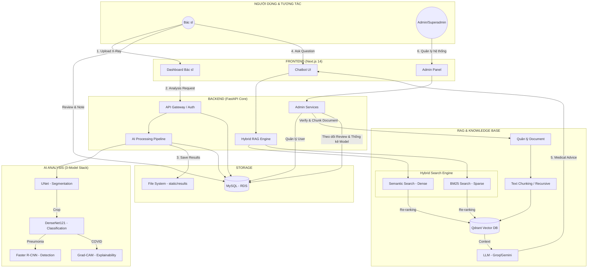
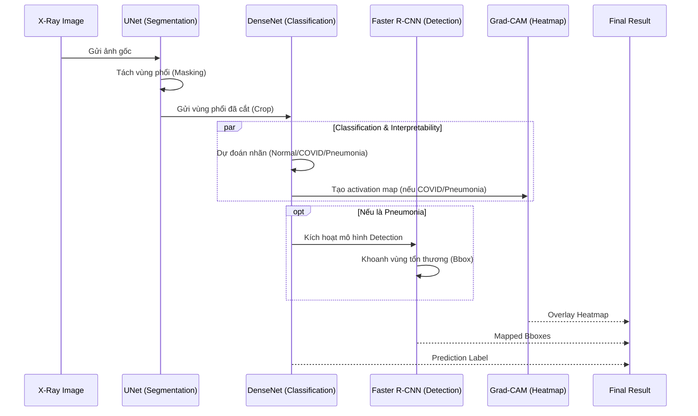

# 🩺 Lung Disease Analysis System (AI-Powered X-Ray Diagnostic)


Hệ thống hỗ trợ chẩn đoán bệnh lý phổi qua ảnh X-quang tích hợp trí tuệ nhân tạo (AI). Dự án sử dụng các mô hình học sâu (Deep Learning) tiên tiến để phân loại bệnh, phát hiện vùng tổn thương và giải thích kết quả thông qua bản đồ nhiệt (Heatmap).

---

## 🏗 Kiến trúc hệ thống toàn diện



---

## 🌟 Tính năng nổi bật

### 1. Phân tích AI đa tầng (Multi-stage AI Pipeline)
*   **Segmentation**: Tự động nhận diện và cắt vùng phổi từ ảnh X-quang gốc (UNet).
*   **Classification**: Phân loại ảnh thành 3 nhóm: **Normal**, **COVID-19**, và **Pneumonia** (DenseNet121).
*   **Object Detection**: Tự động khoanh vùng (Bounding Box) các vùng tổn thương (Faster R-CNN).
*   **XAI (Grad-CAM)**: Bản đồ nhiệt được hòa trộn mượt mà (Alpha Blending) giúp bác sĩ chẩn đoán chính xác.

### 2. Hệ thống RAG (Retrieval-Augmented Generation) 🆕
*   **Hybrid Search**: Kết hợp sức mạnh của **Semantic Search** (Dense) và **BM25** (Sparse).
*   **Kiến thức Y khoa**: Tra cứu nhanh chóng các tài liệu y tế từ Qdrant Vector DB dựa trên ngữ cảnh thực tế.
*   **Độ chính xác cao**: Giảm thiểu hiện tượng ảo giác của LLM bằng dữ liệu y khoa tin cậy.

### 3. Hệ thống quản trị & Giám sát (Admin & Monitoring) 🆕
*   **Review Tracking**: Admin có thể xem chi tiết các thay đổi, ghi chú (notes) của bác sĩ so với dự đoán ban đầu của AI để đánh giá độ chính xác thực tế.
*   **Document Verification**: Quy trình duyệt tài liệu y khoa nghiêm ngặt trước khi đưa vào bộ nhớ RAG (Chunking & Vectorize).
*   **User Management**: Quản lý tài khoản, phân quyền Superadmin/Doctor và theo dõi lịch sử hoạt động.
*   **Model Statistics**: Thống kê hiệu suất dự đoán của từng phiên bản mô hình AI.

### 4. Quản lý hồ sơ & UI/UX
*   Tải lên và lưu trữ ảnh X-quang định dạng chất lượng cao.
*   Giao diện **Glassmorphism** sang trọng, hỗ trợ tương tác ảnh (Zoom/Pan/Reset).
*   Hệ thống thông báo Progress Bar thời gian thực.

---

## 🛠 Công nghệ sử dụng

### Backend (FastAPI)
- **Framework**: FastAPI (Python 3.10+)
- **AI/ML Stack**: `PyTorch`, `TorchXRayVision`, `OpenCV`.
- **RAG Stack**: 
    - `Qdrant`: Vector Database cho tìm kiếm Hybrid.
    - `Groq / Gemini API`: Tích hợp Large Language Models.
    - `Sentence-Transformers`: Tạo embeddings cho Semantic Search.
- **Database**: MySQL (SQLAlchemy ORM).
- **Security**: JWT Authentication, RBAC.

### Frontend (Next.js)
- **Framework**: Next.js 14 (App Router).
- **Language**: TypeScript.
- **Styling**: Tailwind CSS & Headless UI.

---

## 📂 Cấu trúc dự án

```text
prj-lung-disease-xray/
├── backend/                # Source code FastAPI
│   ├── ai_models/          # Quản lý các mô hình AI
│   ├── rag/                # Hệ thống RAG (Hybrid Search, BM25)
│   ├── llm/                # Tích hợp LLM (Groq, Gemini)
│   ├── core/               # App config, DB session, AI Manager
│   ├── models/             # SQLAlchemy Database Models
│   ├── schemas/            # Pydantic schemas (Request/Response)
│   ├── router/             # API Endpoints (Auth, Images, Analysis, Admin)
│   ├── services/           # AI Pipeline logic & Business logic
│   └── app.py              # Application Entry Point
├── front-end-medical/      # Source code Next.js
│   ├── app/                # Dashboard, Reviews, Admin, Users
│   ├── components/         # UI Components (Canvas, Toast, Table)
│   ├── context/            # Global State (Auth, Toast)
│   └── lib/                # API Client và Utils
```

---

## 🚀 Hướng dẫn cài đặt

### 1. Backend
```bash
cd backend
python -m venv venv
source venv/bin/activate
pip install -r requirements.txt

# Cấu hình môi trường (.env)
SECRET_KEY=your-default-secret-key
ALGORITHM=HS256
ACCESS_TOKEN_EXPIRE_MINUTES=30
REFRESH_TOKEN_EXPIRE_DAYS=30

MYSQL_HOST=localhost
MYSQL_PORT=3306
MYSQL_DB=lung_disease_db
MYSQL_USER=root
MYSQL_PASSWORD=your_password

REDIS_HOST=localhost
REDIS_PORT=6379
QDRANT_URL=http://localhost:6333
GROQ_API_KEY=your_groq_key

# AI Models Paths
CLASSIFICATION_MODEL_PATH=weights/classification.pth
DETECTION_MODEL_PATH=weights/detection.pth
SEGMENTATION_MODEL_PATH=weights/segmentation.pth

uvicorn app:app --reload --port 8000
```

### 2. Frontend
```bash
cd front-end-medical
npm install
npm run dev
```

---

## 👨‍⚕️ Quy trình làm việc (Workflow)

1. **Upload**: Bác sĩ tải ảnh X-quang lên.
2. **AI Analysis**: Tự động chạy Pipeline Segmentation -> Classification -> Detection.
3. **Knowledge Retrieval (RAG)**: Hệ thống tra cứu tài liệu y khoa liên quan dựa trên nhãn bệnh tìm được qua Hybrid Search.
4. **Review & Approve**: Bác sĩ xem kết quả AI + Tài liệu tham khảo và lưu hồ sơ.

---

## ⚙️ Chi tiết AI Pipeline



---

## 📝 Giấy phép
Dự án được phát triển cho mục đích học thuật và hỗ trợ nghiên cứu y tế.

---
*Phát triển bởi đội ngũ dự án Lung Disease Analysis.*
