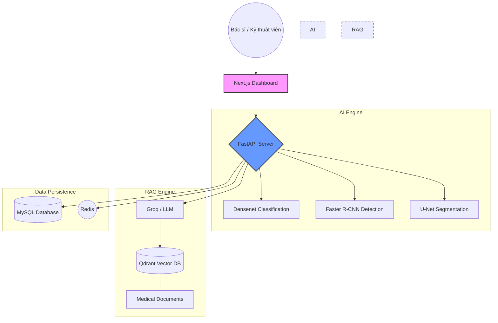
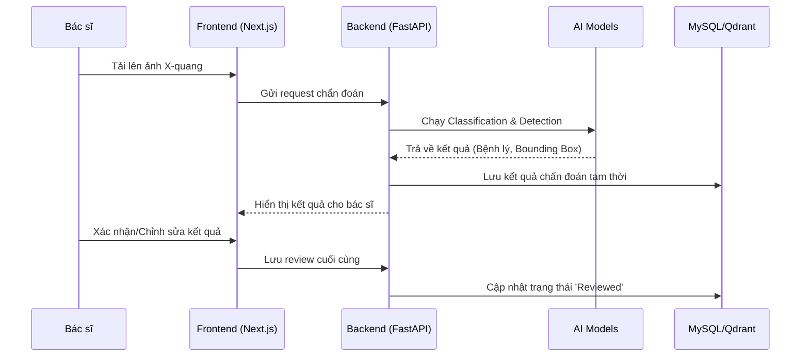

# Lung Disease X-Ray AI System 🫁🔬

Hệ thống hỗ trợ chẩn đoán bệnh lý phổi qua hình ảnh X-quang tích hợp Trí tuệ nhân tạo (AI) và Hệ thống hỏi đáp thông minh (RAG).

## 🌟 Giới thiệu
Dự án là một nền tảng y tế hiện đại, kết hợp sức mạnh của Computer Vision để phân tích hình ảnh X-quang phổi và Large Language Models (LLM) để cung cấp khả năng tra cứu, tư vấn y khoa dựa trên tài liệu. Hệ thống giúp bác sĩ tối ưu hóa quy trình chẩn đoán và quản lý hồ sơ bệnh án một cách hiệu quả.

## 🏗 Kiến trúc hệ thống


## ✨ Tính năng chính
- **AI Inference**: Hệ thống đa nhiệm tích hợp:
  - **Classification**: Phân loại các loại bệnh lý phổi (Pneumonia, Effusion, COVID-19, v.v.).
  - **Object Detection**: Phát hiện và khoanh vùng (bounding box) các tổn thương trên phổi.
  - **Segmentation**: Phân vùng chi tiết các khu vực bị ảnh hưởng (sử dụng U-Net).
  - Tích hợp kỹ thuật **Grad-CAM** để giải thích kết quả dự đoán của mô hình.
- **RAG Chatbot**: Hệ thống hỏi đáp thông minh dựa trên tài liệu y khoa được tải lên, sử dụng Qdrant làm Vector Database (Hybrid Search).
- **Doctor Review**: Hệ thống quản lý và phê duyệt kết quả chẩn đoán từ bác sĩ, cho phép chỉnh sửa bounding box và ghi chú chuyên môn.
- **Document Management**: Quản lý tài liệu y khoa, tự động trích xuất và indexing dữ liệu phục vụ tra cứu.
- **User Management**: Hệ thống phân quyền người dùng (Bác sĩ, Kỹ thuật viên, Quản trị viên).

## 🔄 Quy trình chẩn đoán


## 🛠 Công nghệ sử dụng

### Backend (FastAPI)
- **Framework**: FastAPI (Python)
- **Database**: MySQL (SQLAlchemy ORM)
- **Vector DB**: Qdrant (Hybrid Search - Dense & Sparse)
- **Task Queue**: Celery & Redis (cho các tác vụ nặng như trích xuất PDF)
- **AI/ML**: PyTorch, TorchXRayVision, TIMM, OpenCV
- **LLM Integration**: Groq API
- **Monitoring**: Weights & Biases (W&B)

### Frontend (Next.js)
- **Framework**: Next.js 14 (App Router)
- **Language**: TypeScript
- **Styling**: Tailwind CSS, Lucide Icons, Glassmorphism UI
- **State Management**: React Context / Hooks

## 📂 Cấu trúc dự án
```text
prj-lung-disease-xray/
├── backend/                # Source code FastAPI
│   ├── ai_models/          # Quản lý các mô hình AI (Classification, Detection, Segmentation)
│   ├── core/               # Cấu hình database, logger, exceptions
│   ├── models/             # Khai báo các bảng cơ sở dữ liệu (SQLAlchemy Models)
│   ├── router/             # Định nghĩa API endpoints
│   ├── services/           # Logic xử lý nghiệp vụ
│   ├── schemas/            # Pydantic schemas cho validation dữ liệu
│   ├── rag/                # Xử lý RAG và Vector DB
│   ├── llm/                # Tích hợp Large Language Models (Groq, v.v.)
│   ├── utils/              # Các hàm tiện ích (Embedding, Qdrant client, v.v.)
│   └── app.py              # Entry point của backend
├── front-end-medical/      # Source code Next.js
│   ├── app/                # Pages & Layouts
│   ├── components/         # UI Components
│   └── lib/                # Utilities & API Fetching
├── dataset/                # Dữ liệu mẫu/huấn luyện
├── static/                 # File tĩnh (ảnh upload, kết quả)
└── requirements.txt        # Thư viện Python cần thiết
```

## 🚀 Hướng dẫn cài đặt

### 1. Cài đặt Backend
1. Di chuyển vào thư mục backend:
   ```bash
   cd backend
   ```
2. Tạo môi trường ảo và cài đặt thư viện:
   ```bash
   python -m venv venv
   source venv/bin/activate  # Trên Windows: venv\Scripts\activate
   pip install -r ../requirements.txt
   ```
3. Cấu hình file `.env`:
   ```env
   # Database
   MYSQL_HOST=localhost
   MYSQL_PORT=3306
   MYSQL_DB=lung_ai_system
   MYSQL_USER=root
   MYSQL_PASSWORD=your_password

   # Redis (Optional for Celery)
   REDIS_URL=redis://localhost:6379/0

   # AI & RAG
   URL_QRDANT=your_qdrant_url
   API_KEY_QRDANT=your_qdrant_key
   GROQ_API_KEY=your_groq_api_key
   
   # Model Paths
   CLASSIFICATION_MODEL_PATH=path/to/your/model.pth
   DETECTION_MODEL_PATH=path/to/your/model.pth
   SEGMENTATION_MODEL_PATH=path/to/your/model.pt
   ```
4. Khởi chạy server:
   ```bash
   python app.py
   ```

### 2. Cài đặt Frontend
1. Di chuyển vào thư mục frontend:
   ```bash
   cd front-end-medical
   ```
2. Cài đặt dependencies:
   ```bash
   npm install
   ```
3. Khởi chạy môi trường development:
   ```bash
   npm run dev
   ```

## 📊 API Documentation
Sau khi khởi chạy backend, bạn có thể truy cập tài liệu API tại:
- Swagger UI: `http://localhost:8000/docs`
- ReDoc: `http://localhost:8000/redoc`

## 📝 License
Dự án được phát triển cho mục đích nghiên cứu và học tập.
